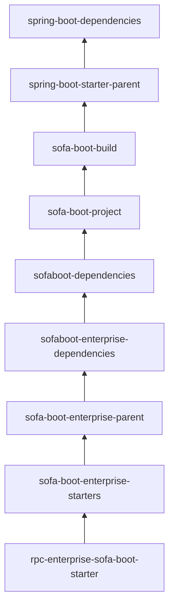

# SOFAstack Learning Guides
[](https://www.oracle.com/cn/java/technologies/downloads/)
[](https://maven.apache.org/download.cgi)

[](https://www.sofastack.tech)
[](https://spring.io/projects/spring-boot#learn)
[](https://spring.io/projects/spring-cloud#learn)
[](https://github.com/alibaba/spring-cloud-alibaba)

[](https://www.jetbrains.com/idea/)

SOFAStack™（Scalable Open Financial Architecture Stack）作为蚂蚁科技自主研发的金融级分布式中间件，被广泛应用在包括支付、借贷、信用、基金、保险等全金融场景。

### 依赖管理
<table>
    <tr>
        <th colspan="2">中间件</th>
        <th>artifactId</th>
    </tr>
    <tr>
        <td rowspan="2">开发框架</td>
        <td>开源版</td>
        <td>sofaboot-dependencies</td>
    </tr>
    <tr>
        <td>商业版</td>
        <td>sofaboot-enterprise-dependencies </td>
    </tr>
    <tr>
        <td rowspan="3">微服务</td>
        <td>服务调用</td>
        <td>rpc-sofa-boot-starter</td>
    </tr>
    <tr>
        <td>动态配置</td>
        <td>ddcs-enterprise-sofa-boot-starter</td>
    </tr>
    <tr>
        <td>限流熔断</td>
        <td>guardian-sofa-boot-starter</td>
    </tr>
    <tr>
        <td colspan="2">健康检查</td>
        <td>actuator-sofa-boot-starter</td>
    </tr>
    <tr>
        <td colspan="2">模块隔离</td>
        <td>isle-sofa-boot-starter</td>
    </tr>
    <tr>
        <td colspan="2">任务调度</td>
        <td>scheduler-enterprise-sofa-boot-starter</td>
    </tr>
    <tr>
        <td colspan="2">消息队列</td>
        <td>sofamq-enterprise-sofa-boot-starter</td>
    </tr>
    <tr>
        <td colspan="2">分布式链路跟踪</td>
        <td>tracer-sofa-boot-starter</td>
    </tr>
    <tr>
        <td>分布式事务</td>
        <td>商业版</td>
        <td>dtx-enterprise-sofa-boot-starter</td>
    </tr>
</table>

### 工程结构
```
sofa-guides 
├── sofa-sample-ddd 
├── sofa-sample-rpc 
|   ├── sofa-sample-rpc-client     
|   ├── sofa-sample-rpc-facade
|   ├── sofa-sample-rpc-server
├── sofa-sample-isle 
|   ├── sofa-sample-isle-consumer     
|   ├── sofa-sample-isle-facade
|   ├── sofa-sample-isle-provider
|   └── sofa-sample-isle-bootstrap
├── sofa-sample-registry 
|   ├── sofa-sample-registry-client     
|   └── sofa-sample-registry-server
├── sofa-cloud-project 
|   ├── sofa-cloud-apigw   
|   ├── sofa-cloud-biz-web
|   ├── sofa-cloud-biz-auth
|   ├── sofa-cloud-biz-user
|   ├── sofa-cloud-biz-accounting
|   ├── sofa-cloud-biz-trading
|   └── sofa-cloud-biz-
└──
```

### SOFA依赖关系
